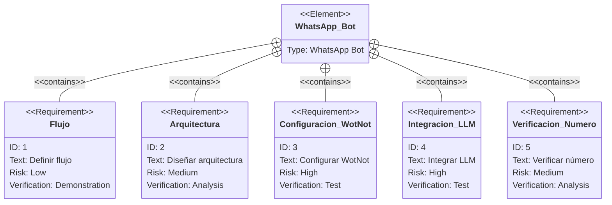
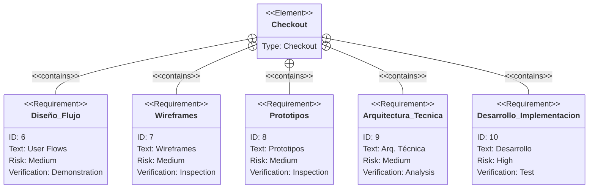
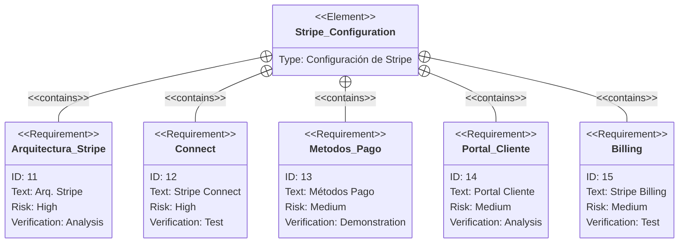

import { Steps } from 'nextra/components'

# Alcance del Proyecto

El proyecto abarca la implementación y configuración de varias tecnologías y herramientas para optimizar la gestión de donaciones de la Cruz Roja.

<Steps>
### Módulo de WhatsApp

Este módulo integra GPT para responder consultas complejas, capturar datos de usuarios y brindar una experiencia de conversación fluida y no lineal. Utilizando WotNot, se permite personalizar flujos, conectar con otras API, generar informes, permitir intervención humana y administrar mensajes entrantes y salientes. El bot contará con capacidades adaptativas respaldadas por la infraestructura de WotNot.

### Módulo Checkout

Este módulo tiene como objetivo crear un enlace de pago personalizado utilizando Stripe Elements que refleje la imagen de la Cruz Roja. La mejora de la experiencia del usuario en el proceso de pago se logrará mediante el uso de imágenes y contenido que resalten el valor de la donación, en lugar de ofrecer un simple formulario de pago. La implementación se realizará utilizando Angular y Tailwind para el frontend, y NestJS para el backend.

### Configuración de Stripe

La implementación y configuración de Stripe está diseñada para gestionar de manera eficiente y segura las donaciones, así como la dispersión de fondos a las delegaciones de la Cruz Roja. Este proceso se basa en cuatro componentes principales de Stripe:

- **Stripe Connect**: Automatiza la dispersión de fondos a las cuentas conectadas de las delegaciones. Esto asegura que cada donación se distribuya de manera eficiente y segura, permitiendo una gestión efectiva de las cuentas conectadas y garantizando la transparencia y precisión en la distribución de los fondos.
- **Métodos de Pago**: Configuración y gestión de diversos métodos de pago locales y globales para optimizar la experiencia del donante.
- **Portal de Cliente**: Facilita a los donantes la gestión de recibos, métodos de pago y facturación a través de un portal de autoservicio. Los donantes pueden actualizar su información de pago, ver y descargar facturas, y gestionar sus suscripciones de manera autónoma.
- **Stripe Billing**: Ofrece un flujo de donaciones seguro, personalizado y eficiente. Permite la gestión de suscripciones, la automatización de flujos de trabajo y la aceptación de pagos en más de 40 métodos de pago locales y 130 monedas.

</Steps>